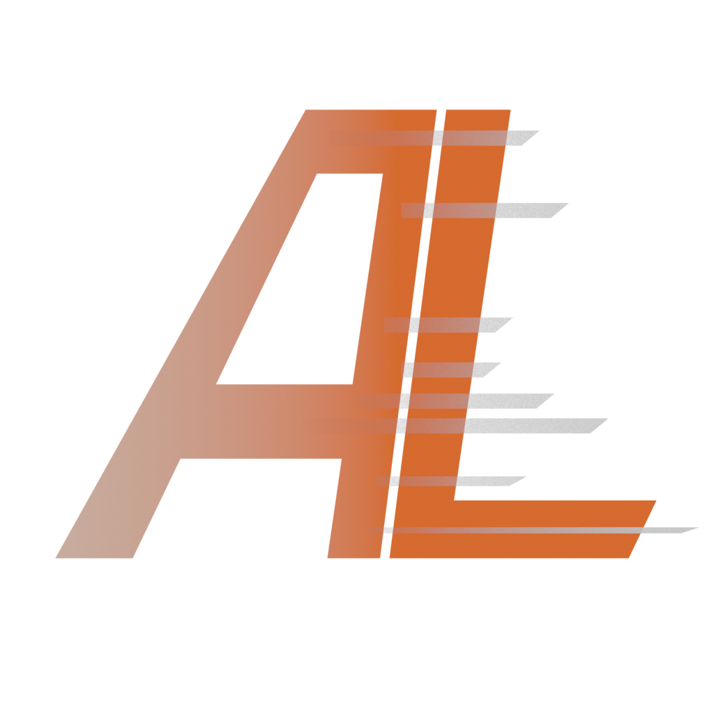

<p align="center">
  
</p>

<h1 align="center">Action Library</h1>

<p align="center">
  <strong>A high-performance animation library manager for Blender</strong>
</p>

<p align="center">
  <a href="https://opensource.org/licenses/MIT"></a>
  <a href="https://www.python.org/downloads/"></a>
  <a href="https://pypi.org/project/PyQt6/"></a>
  <a href="https://www.blender.org/"></a>
</p>

<p align="center">
  <a href="#features">Features</a> •
  <a href="#installation">Installation</a> •
  <a href="GETTING_STARTED.md">Getting Started</a> •
  <a href="STUDIO_GUIDE.md">Studio Guide</a> •
  <a href="CHANGELOG.md">Changelog</a>
</p>

---

> **⚠️ Upgrading from v1.2 or earlier?**
>
> Version 1.3 includes a database overhaul that is **not backwards compatible**.
>
> **Before updating:** Apply your animations to Blender and save them as .blend files.
> **After installing v1.3:** Start fresh and re-capture your animations from Blender.
>
> See the [Changelog](CHANGELOG.md) for details. We apologize for the inconvenience—this change was necessary for long-term stability.

---

## Background

This tool was built after completing a 55-minute 3D animated feature film, produced largely as a solo technical director.

During production, I repeatedly hit limitations in Blender when managing animation data at scale—particularly around reuse, organization, and pipeline-style workflows. By the end, these issues formed a clear pattern.

Action Library is the result: a Blender-native, pipeline-oriented animation manager designed for scalability and long-form production. Open-sourced so others working on serious Blender projects can build on the same foundation.

## Features

- **High Performance** - Handles 1000+ animations with smooth scrolling
- **Actions & Poses** - Store multi-frame animations and single-frame poses
- **Pose Blending** - Right-click drag to blend between poses in real-time
- **Version Control** - Track iterations with lineage system (v001 → v002 → v003)
- **Instant Apply** - Real-time socket connection to Blender, no polling delays
- **Smart Organization** - Folders, tags, favorites, search, and filtering
- **Studio Naming** - Template-based naming for pipeline integration
- **Dailies & Review** - Version comparison, timestamped review notes, drawover annotations
- **Selective Capture** - Capture specific frame ranges or selected bones only
- **Lifecycle Status** - WIP → Review → Approved workflow (optional)
- **Modern UI** - Grid/list views, 4 themes + custom theme editor
- **Keyboard Shortcuts** - J/K/L playback, Ctrl/Alt/Shift modifiers for apply modes
- **Portable** - Single folder, no installation required

See the [Changelog](CHANGELOG.md) for detailed version history.

## Installation

### Option 1: Download Release (Recommended)

Download the latest portable release from the [Releases](../../releases) page.

> **Note:** Windows may show an "Unknown publisher" warning on first run. Click **More info** → **Run anyway**. This is normal for unsigned open source software.

### Option 2: Run from Source

**Prerequisites:**
- Python 3.9 or higher
- Git

**Steps:**

```bash
# Clone the repository
git clone https://github.com/CGstuff/action-library.git
cd action-library

# Create virtual environment
python -m venv venv

# Activate virtual environment
# Windows:
venv\Scripts\activate
# macOS/Linux:
source venv/bin/activate

# Install dependencies
pip install -r requirements.txt

# Run the application
python run.py
```

## Building Portable Version

To create a standalone portable build:

```bash
# Install PyInstaller (if not already installed)
pip install pyinstaller

# Run the build script
build.bat
```

The portable build will be created in `dist/ActionLibrary/`.

## Architecture

Built with:
- **PyQt6** - Modern Qt6 bindings for Python
- **Model/View Pattern** - Virtual scrolling, renders only visible items
- **Async Loading** - Background thumbnail loading via thread pool
- **Event Bus** - Decoupled component communication
- **SQLite + WAL** - Fast local database with concurrent access
- **Dependency Injection** - Testable, modular services

**Performance**: Tested with 1000+ animations. First launch caches thumbnails; subsequent launches are near-instant.

For detailed architecture information, see [ARCHITECTURE.md](ARCHITECTURE.md).

## Documentation

- [Getting Started](GETTING_STARTED.md) - First-time setup and onboarding guide
- [Studio Guide](STUDIO_GUIDE.md) - Multi-user deployment and pipeline integration
- [Architecture Overview](ARCHITECTURE.md) - System design and patterns
- [Developer Guide](DEVELOPER_GUIDE.md) - Development setup and guidelines
- [Widget Reference](WIDGET_REFERENCE.md) - UI component documentation
- [Contributing](CONTRIBUTING.md) - How to contribute
- [Changelog](CHANGELOG.md) - Version history

## License

This project is licensed under the MIT License - see the [LICENSE](LICENSE) file for details.
